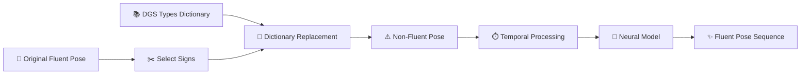
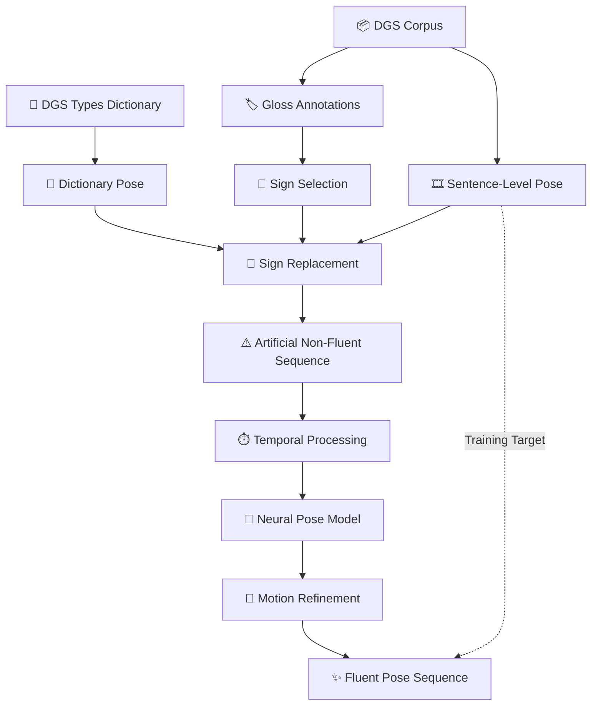
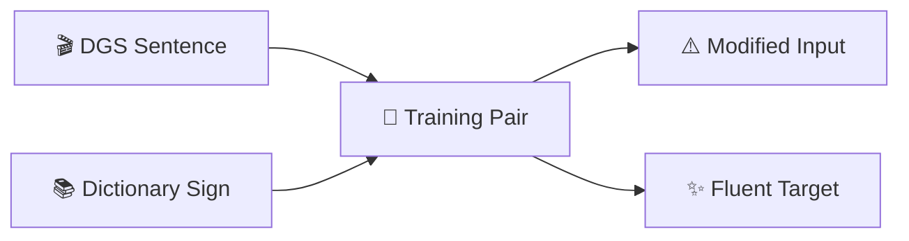
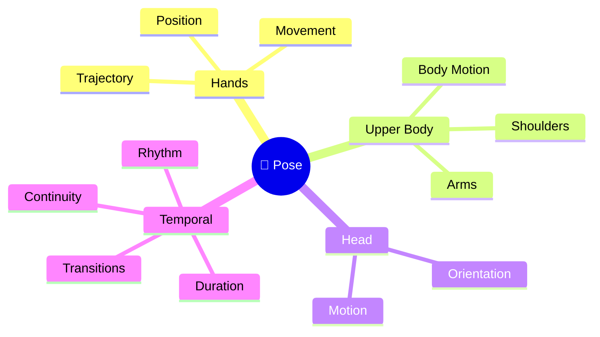
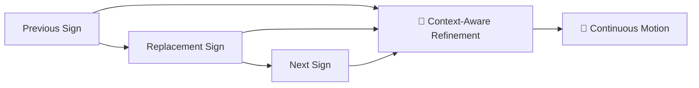
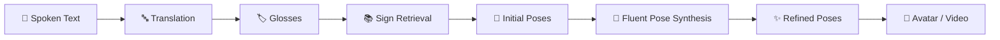
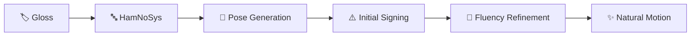
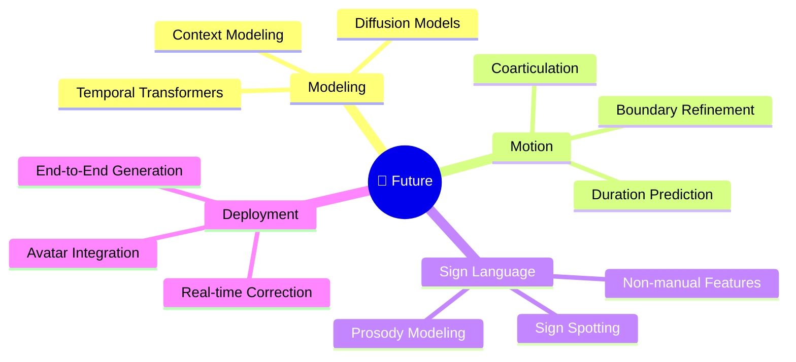

<div align="center">

# 🤟 Fluent Sign Language Pose Synthesis

### From isolated dictionary signs to fluent, temporally coherent sign language motion

<br>


<br>

**Pose Processing • Temporal Modeling • Motion Synthesis • Deep Learning • Sign Language AI**

<br>

> **A neural post-editing pipeline designed to transform mechanically assembled sign-language pose sequences into smoother, more natural and context-aware signing.**

</div>

---

## ✨ What Does This Project Do?

Sign-language generation systems can retrieve or generate the **correct individual signs** while still producing unnatural sentences.

Why?

Because fluent signing is not simply:

```text
SIGN A + SIGN B + SIGN C + SIGN D
```

Natural signing contains continuous transitions, timing, rhythm, contextual motion and prosody.

This project tackles that problem directly.

<div align="center">

### ❌ Dictionary-style generation

`SIGN A` → `SIGN B` → `SIGN C` → `SIGN D`

⬇

**Correct signs — unnatural motion**

### 🧠 Fluent Pose Synthesis

`Dictionary Poses` → `Temporal Alignment` → `Neural Refinement` → `Fluent Motion`

⬇

### ✨ Natural continuous signing

</div>

---

# 🧠 The Core Idea

Instead of regenerating an entire sign-language sentence, the system learns to **post-edit pose sequences**.

It takes a sequence containing dictionary-form sign replacements and learns to reconstruct the fluent sentence-level motion.



### Learning objective

```text
Modified / Non-Fluent Pose
              ↓
        Neural Model
              ↓
Reconstructed Fluent Pose
              ≈
Original Natural Signing
```

---

# 🚀 End-to-End Pipeline



---

# 🎯 The Problem

A generated sign-language sentence may be linguistically correct while still looking unnatural.

<div align="center">

| Dictionary Signing | Natural Sentence Signing |
|---|---|
| Independent signs | Context-dependent motion |
| Fixed duration | Adaptive timing |
| Hard boundaries | Smooth transitions |
| Isolated movement | Continuous motion |
| Mechanical rhythm | Natural prosody |

</div>

### The key observation

<div align="center">

## Correct Signs ≠ Fluent Signing

**Lexical correctness alone is not enough.**

</div>

The challenge is therefore not only deciding **which signs should be generated**, but also determining **how those signs should flow together through time**.

---

# 🔬 Training Strategy

The project creates supervised training examples from naturally fluent signing.

### ① Start with a fluent sentence

```text
SIGN_A → SIGN_B → SIGN_C → SIGN_D → SIGN_E
```

### ② Select signs for replacement

```text
SIGN_A → [SIGN_B] → SIGN_C → [SIGN_D] → SIGN_E
```

### ③ Retrieve dictionary versions

```text
SIGN_B → DICTIONARY_B
SIGN_D → DICTIONARY_D
```

### ④ Construct an intentionally degraded sequence

```text
SIGN_A → DICT_B → SIGN_C → DICT_D → SIGN_E
```

### ⑤ Train the network

```text
INPUT
Modified / Non-Fluent Pose Sequence

                ↓

            🧠 MODEL

                ↓

TARGET
Original Fluent Pose Sequence
```

This provides a scalable way of generating:

<div align="center">

### `Non-Fluent Pose → Fluent Pose`

training pairs.

</div>

---

# 📦 Dataset Engineering

The pipeline combines two complementary sign-language resources.

### 🎬 DGS Corpus

Used for naturally occurring **sentence-level signing**.

Provides the fluent target sequences.

### 📚 DGS Types

Used for **dictionary-level sign representations**.

Provides isolated signs that can replace signs inside sentence-level sequences.

Together:



---

# 🗂️ Generated Training Data

Run:

```bash
python fluent_pose_synthesis/data/create_data.py \
  --corpus_dir pose_data/tfds_dgs \
  --dictionary_dir pose_data/tfds_dgs \
  --output_dir pose_data/output
```

The preprocessing pipeline generates:

```text
pose_data/
│
├── tfds_dgs/
│
└── output/
    │
    ├── train/
    │   ├── train_1_original.pose
    │   ├── train_1_updated.pose
    │   ├── train_1_metadata.json
    │   └── ...
    │
    ├── validation/
    │
    └── test/
```

### Each sample contains

| File | Purpose |
|---|---|
| 🟢 `*_original.pose` | Original fluent sentence |
| 🟠 `*_updated.pose` | Dictionary-modified sequence |
| 🔵 `*_metadata.json` | Sample metadata |

This gives the training pipeline explicit:

```text
INPUT POSE  ──────────────►  TARGET POSE
Modified                     Original Fluent
```

pairs.

---

# 🦴 Why Pose-Level Modeling?

The system operates on **structured human pose sequences** instead of raw RGB pixels.

That allows the model to focus on the information that actually defines signing motion.



This reduces dependence on irrelevant visual characteristics such as:

`Background` • `Lighting` • `Clothing` • `Camera Appearance`

and focuses learning on:

`Motion` • `Timing` • `Pose` • `Transitions`

---

# ⏱️ Temporal Alignment

One of the hardest problems is that an isolated dictionary sign may have a completely different duration from the same sign inside a sentence.

```text
Sentence Context

|──────────── SIGN ────────────|

Dictionary

|────── SIGN ──────|
```

A direct replacement can therefore break the timing of the sentence.

The pipeline handles the problem as:

```text
Dictionary Pose
      │
      ▼
Temporal Adaptation
      │
      ├── Stretch
      │
      └── Compress
      │
      ▼
Context-Compatible Duration
      │
      ▼
Neural Refinement
```

---

# 🌊 Motion Continuity

Matching duration alone does not create fluent signing.

Consider:

```text
Previous Sign
     │
     ▼
██████████
          ╳  ← Abrupt transition
           █████████
           Dictionary Sign
                    ╳  ← Abrupt transition
                     █████████
                          │
                          ▼
                       Next Sign
```

The system therefore considers the replacement inside its surrounding motion context.



The objective is not merely to preserve the replacement sign.

It is to make the **entire sequence move naturally**.

---

# 🎼 Prosody & Intonation

Natural sign language contains sentence-level information beyond lexical signs.

The project focuses on motion properties associated with:

<table>
<tr>
<td align="center">⏱️<br><b>Timing</b></td>
<td align="center">🎵<br><b>Rhythm</b></td>
<td align="center">🌊<br><b>Continuity</b></td>
<td align="center">🔄<br><b>Transitions</b></td>
<td align="center">🤟<br><b>Sign Duration</b></td>
<td align="center">🎭<br><b>Prosody</b></td>
</tr>
</table>

This turns sign synthesis into a **sequence-level human-motion problem**, rather than treating every sign as an independent visual unit.

---

# 🔗 Where It Fits

Fluent Pose Synthesis can operate as a post-processing stage inside a larger sign-language generation system.



This makes the system modular.

It does not need to replace the translation or avatar-generation components.

Instead, it solves the difficult intermediate problem of:

<div align="center">

### `Mechanical Pose Sequence → Fluent Motion`

</div>

---

# 🔤 HamNoSys-Compatible Workflow

Pose generation may also originate from symbolic sign representations such as **HamNoSys**.



This allows pose refinement to sit downstream of different sign-generation approaches.

---

# ⚙️ Installation

### 1️⃣ Clone

```bash
git clone https://github.com/sign-language-processing/fluent-pose-synthesis.git

cd fluent-pose-synthesis
```

### 2️⃣ Create the environment

```bash
conda env create -f environment.yml
```

### 3️⃣ Activate

```bash
conda activate fluent-pose
```

### Alternative

Install directly from GitHub:

```bash
pip install git+https://github.com/sign-language-processing/fluent-pose-synthesis
```

---

# 🧪 Debug Training

Before running larger experiments, the complete training pipeline can be tested with:

```bash
python fluent_pose_synthesis/train.py \
  --name debug \
  --data pose_data/output \
  --save save/debug_run
```

### Debug configuration

<table>
<tr>
<td align="center"><b>16</b><br>Training Examples</td>
<td align="center"><b>16</b><br>Batch Size</td>
<td align="center"><b>100</b><br>Epochs</td>
<td align="center"><b>save/debug_run</b><br>Output</td>
</tr>
</table>

This verifies the complete path:

```text
Dataset
   ↓
Pose Loading
   ↓
Batch Construction
   ↓
Model Forward Pass
   ↓
Loss
   ↓
Optimization
   ↓
Logging
   ↓
Checkpoint
```

---

# 🧪 Evaluation

Sign-language motion quality cannot be captured reliably by a single metric.

The project therefore considers two complementary evaluation directions.

### 📐 Objective Evaluation

```text
Pose Reconstruction
Motion Consistency
Sign Recognition
Sequence Quality
```

### 👥 Human Evaluation

```text
Naturalness
Fluency
Transition Quality
Perceived Signing Quality
```

This distinction matters because:

<div align="center">

### Low Pose Error ≠ Natural Signing

</div>

A sequence may be numerically close to a target while still looking unnatural to a signer.

---

# ⚡ Engineering Challenges

| Challenge | What the System Must Solve |
|---|---|
| 🔗 **Sign Concatenation** | Convert isolated signs into continuous motion |
| ⏱️ **Variable Duration** | Handle context-dependent sign lengths |
| 🔄 **Temporal Alignment** | Stretch/compress replacement motion |
| 🌊 **Transitions** | Remove abrupt sign boundaries |
| 🧠 **Context Modeling** | Use surrounding motion information |
| 🤟 **Content Preservation** | Maintain intended linguistic content |
| 🦴 **Pose Complexity** | Model spatial + temporal dependencies |
| 📦 **Dataset Generation** | Automatically construct training pairs |

---

# 🏗️ Repository Structure

```text
fluent-pose-synthesis/
│
├── 📂 fluent_pose_synthesis/
│   │
│   ├── 📂 data/
│   │   └── create_data.py
│   │
│   ├── train.py
│   └── ...
│
├── 📂 pose_data/
│   │
│   ├── tfds_dgs/
│   │
│   └── output/
│   │       ├── train/
│   │       ├── validation/
│   │       └── test/
│
├── 📂 save/
│   └── debug_run/
│
├── environment.yml
└── README.md
```

---

# 🛠️ Technical Stack

<div align="center">


</div>

### Core Areas

<div align="center">

`Pose Processing`
&nbsp; • &nbsp;
`Sequence Modeling`
&nbsp; • &nbsp;
`Temporal Alignment`
&nbsp; • &nbsp;
`Motion Synthesis`
&nbsp; • &nbsp;
`Dataset Engineering`
&nbsp; • &nbsp;
`Sign Language AI`

</div>

---

# 💡 Research Motivation

Many sign-generation pipelines primarily optimize:

> **What sign should appear next?**

But natural signing requires another equally important question:

> **How should the movement flow from one sign to the next?**

This project targets that second problem.

```text
         SIGN LANGUAGE GENERATION
                   │
          ┌────────┴────────┐
          │                 │
          ▼                 ▼
    WHAT TO SIGN       HOW TO MOVE
          │                 │
     Translation        Fluency
     Glosses            Timing
     Lexical choice     Transitions
          │                 │
          └────────┬────────┘
                   ▼
            Natural Signing
```

---

# 🌍 Potential Applications

<table>
<tr>
<td width="50%">

### 🤟 Sign Language Translation
Improve automatically generated signing after translation.

### 🧍 Signing Avatars
Generate smoother motion before avatar rendering.

### 🎥 Video Generation
Refine pose sequences before realistic video synthesis.

</td>
<td width="50%">

### ✏️ Sign Editing
Replace incorrect signs without regenerating full sentences.

### ♿ Accessibility AI
Support more natural machine-generated signing.

### 🔬 Sign Language Research
Study isolated vs. sentence-level motion.

</td>
</tr>
</table>

---

# 🔮 Future Directions



---

# 🏆 Project Highlights

<div align="center">

| | |
|---|---|
| 🧠 | **Neural pose-sequence post-editing** |
| 🤟 | **Sign-language-specific motion modeling** |
| 📦 | **Automatic paired dataset generation** |
| ⏱️ | **Temporal alignment and duration handling** |
| 🌊 | **Motion continuity and transition refinement** |
| 🦴 | **Structured pose-level representation** |
| 🔗 | **Compatible with larger generation pipelines** |
| 🔬 | **Research-oriented training & evaluation workflow** |

</div>

---

# 🎯 Vision

<div align="center">

### Moving from...

```text
Correct Signs
      +
Mechanical Concatenation
```

### ...toward

```text
             Correct Signs
                   +
             Natural Timing
                   +
           Continuous Motion
                   +
        Contextual Transitions
                   +
                Prosody
                   │
                   ▼
        ✨ FLUENT SIGNING ✨
```

### Sign generation should not only be correct.

## It should move naturally.

</div>

---

# 👩‍💻 Author

<div align="center">

## Habeba Mohamed Fetouh

### AI / Machine Learning & Computer Vision Engineer

`Computer Vision` • `Deep Learning` • `Sign Language AI`  
`Pose Processing` • `Human Motion` • `Sequence Modeling`

<br>

**Building AI systems that understand not only what humans communicate — but how they move.**

</div>

---

## ⚠️ Research Note

This project is intended for research and development in sign-language processing and pose synthesis.

Evaluation of generated signing should include appropriate linguistic expertise and, where possible, feedback from members of the relevant Deaf and signing communities.

---

<div align="center">

### 🤟 From isolated signs to continuous, fluent motion.

<br>


<br><br>

**⭐ Star this repository if you find the project useful.**

</div>
